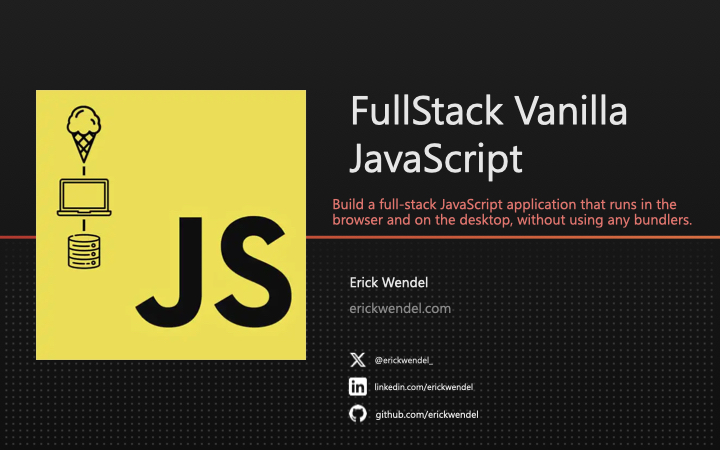

# Fullstack-vanilla-javaScript-fem


## Abstract Factory
```
.
├── src
│   ├── platforms
│   │   ├── console
│   │   │   └── view.js
│   │   └── web
│   │       └── view.js
│   └── shared
│       └── viewBase.js
└── ui
    └── index.html
```
platforms/ - Platform-Specific Implementations: You have different implementations (view.js files) for console and web platforms, indicating that your controller might instantiate these based on the context or platform

ui/index.js - Factory Behavior: Your controller is acting as a factory that decides which specific view to create based on the app running, which is the core of the Abstract Factory pattern.

# Fullstack Vanilla JavaScript

> August 28 to 29, 2024 - 9:30am to 5:30pm Central Daylight Time




Acess the [slides](https://www.icloud.com/keynote/032Y1iBWTJMdLbFIw2A3F23VA#FullStack_Vanilla_JS_-_FEM_-_Erick_Wendel)

## Key Takeaways

By participating along with us in the workshop, you'll learn:

- Develop web apps and CLI apps using Node.js without relying on bundlers
- Apply design patterns for building universal JavaScript applications
- Learn how to efficiently share code between the server and client
- Test your JavaScript code using the native Node.js test runner
- Deploy your CLI app to an npm registry and your web app to GitHub Pages

### Is This Workshop for Me?

This course is designed for developers who want to build full-stack JavaScript applications without relying on bundlers, and efficiently share code between the browser and Node.js environments.

## Workshop Details

In this app-oriented course, you’ll create and deploy a complete multi-platform application that runs in the browser and the desktop, sharing JavaScript code. Each hour, you’ll refactor and advance your application, learning fundamental concepts about ES Modules, code sharing, design patterns, best practices, and testing along the way.

### Any Prerequisites?

- Familiarity with JavaScript and Node.js
- Basic understanding of web development concepts
- Experience with npm and GitHub
